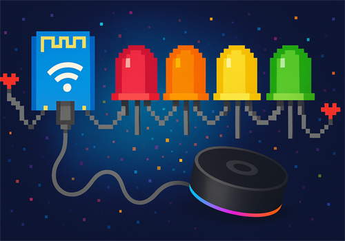

# WLED Controller for Homey

Control your WLED-powered LED strips directly from Homey with this app. Adjust colors, brightness, effects, and create amazing light scenes integrated with your smart home.

## Features

- **Quick Control**: Turn your LED strips on/off and adjust brightness
- **Color Control**: Full RGB color control with hue and saturation adjustments
- **Effects**: Choose from 100+ built-in WLED effects
- **Color Palettes**: Apply beautiful color palettes to your effects
- **Playlists**: Create sequences of effects with custom timings
- **Individual LEDs**: Control specific LED segments for precise lighting
- **Auto Discovery**: Automatically finds WLED devices on your network
- **Manual Setup**: Manually add WLED devices by IP address

## Requirements

- Homey Pro
- WLED-powered LED strips (v0.13.0 or newer recommended)
- LED strips connected to your local network

## Installation

1. Install the app from the Homey App Store
2. Start the pairing process from the Homey Devices panel
3. Choose between automatic discovery or manual IP entry
4. Follow the on-screen instructions to complete the pairing

## Usage

### Basic Control

Use the basic controls to adjust brightness and turn your LED strips on or off. The color wheel lets you set any RGB color.

### Effects

Choose from the built-in WLED effects to create dynamic lighting scenes. Each effect can be further customized with different speeds and intensities.

### Palettes

Apply color palettes to effects to change their appearance without changing the motion pattern.

### Advanced Features

- **Playlists**: Create sequences of presets with custom durations
- **Individual LED Control**: Control specific sections of your LED strip for more precise setups

## Flow Support

This app adds several flow cards to Homey:

### Triggers

- When a WLED device turns on/off
- When brightness changes
- When effect changes

### Conditions

- Check if a WLED device is on/off
- Check current effect
- Check current brightness level

### Actions

- Turn on/off
- Set brightness
- Set color
- Set effect
- Set color palette
- Start playlist
- Control individual LEDs

## Troubleshooting

- **Device Not Discovered**: Make sure your WLED device is on the same network as your Homey
- **Connection Issues**: Check that the IP address is correct and that your WLED device is online
- **Effect Not Working**: Some effects may not be available depending on your WLED version
- **Manual IP Required**: If automatic discovery doesn't work, try adding your device manually with its IP address

## Support

- Issues and feature requests: [GitHub Issues](https://github.com/svipler/com.svipler.app.wled/issues)
- For questions: [Homey Community](https://community.homey.app)

## Credits

- [WLED Project](https://kno.wled.ge/) - The amazing open-source LED control software
- [WLED JSON API Documentation](https://kno.wled.ge/interfaces/json-api/) - Reference for the API implementation

## License

This Homey app is licensed under the MIT License - see the LICENSE file for details.

## Changelog

### 1.0.0
- Initial release
- Basic control (on/off, brightness, color)
- Effects and palettes support
- Automatic discovery and manual IP configuration
- Flow cards for automation