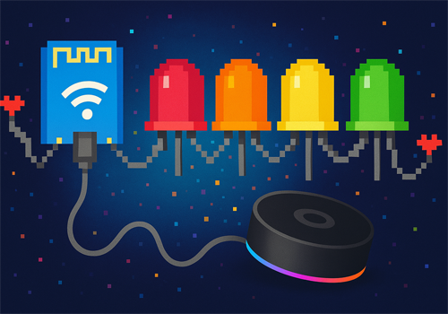

# WLED Controller for Homey

Control your WLED-powered LED strips directly from Homey with this app. Adjust colors, brightness, effects, and create amazing light scenes integrated with your smart home.

## Features

- **Quick Control**: Turn your LED strips on/off and adjust brightness
- **Color Control**: Full RGB color control with hue and saturation adjustments
- **Effects**: Choose from 100+ built-in WLED effects
- **Color Palettes**: Apply beautiful color palettes to your effects
- **Reliable Discovery**: Automatically finds WLED devices on your network with improved stability
- **Manual Setup**: Manually add WLED devices by IP address when needed

## Requirements

- Homey Pro
- WLED-powered LED strips (v0.13.0 or newer recommended)
- LED strips connected to your local network

## Installation

1. Install the app from the Homey App Store
2. Start the pairing process from the Homey Devices panel
3. Choose between automatic discovery or manual IP entry
4. Follow the on-screen instructions to complete the pairing

## Pairing Process

### Automatic Discovery

The app will automatically scan your network for WLED devices:

1. Navigate to the WLED app in Homey's add device flow
2. Select "Discover WLED Devices" 
3. Select your device from the discovered list
4. Tap "Add Selected Device" to complete the pairing

### Manual Entry

If your WLED device isn't automatically discovered:

1. Navigate to the WLED app in Homey's add device flow
2. Select "Manual Entry"
3. Enter the IP address of your WLED device
4. Tap "Test Connection" to verify
5. Tap "Add Device" to complete the pairing

## Usage

### Basic Control

Use the basic controls to adjust brightness and turn your LED strips on or off. The color wheel lets you set any RGB color.

### Effects

Choose from the built-in WLED effects to create dynamic lighting scenes. Each effect can be further customized with different speeds and intensities.

### Palettes

Apply color palettes to effects to change their appearance without changing the motion pattern.

## Flow Support

### Actions

**Whole device**
- **Set Effect**, **Set Palette**, **Set Preset** - pick from what the device reports
- **Next preset** / **Previous preset** - cycle through the presets saved on the device, wrapping around

**Individual segments** - for strips split into several segments, these leave the other segments untouched
- **Set effect on a segment**
- **Set palette on a segment**
- **Set color on a segment**
- **Set brightness on a segment**
- **Turn a segment on or off**

On top of these, Homey generates the standard light actions from the device
capabilities: turn on/off, set brightness, set color and set color temperature.

### Triggers

- **The effect changed**, **The palette changed**, **The preset changed** - each with the
  name and the ID as tokens. These also fire when the change is made from the
  WLED interface itself, not just from Homey.

### Conditions

- **The effect is / is not**
- **The palette is / is not**
- **The preset is / is not**

Effects, palettes, presets and segments are all read from the device itself, so
the lists always match the firmware you are running. Presets have to be saved in
the WLED interface before they show up.

## Troubleshooting

- **Device Not Discovered**: Make sure your WLED device is on the same network as your Homey
- **Connection Issues**: Check that the IP address is correct and that your WLED device is online
- **Effect Not Working**: Some effects may not be available depending on your WLED version
- **Preset Does Nothing**: The preset has to exist on the device. Save it in the WLED interface first - only saved presets are offered in the flow card
- **Color Temperature**: On strips without dedicated CCT channels the white point is approximated on the RGB channels, since WLED's `cct` only drives real CCT hardware
- **Discovery Problems**: If discovery doesn't work consistently, try the manual IP entry method

## Support

- Issues and feature requests: [GitHub Issues](https://github.com/svipler/com.svipler.app.wled/issues)
- For questions: [Homey Community](https://community.homey.app)

## Credits

- [WLED Project](https://kno.wled.ge/) - The amazing open-source LED control software
- [WLED JSON API Documentation](https://kno.wled.ge/interfaces/json-api/) - Reference for the API implementation

## License

This Homey app is licensed under the MIT License - see the LICENSE file for details.

## Changelog

### 1.2.0

Fixes:
- Color temperature: warm no longer produced cold white. The white channel is now
  driven correctly on RGB+CCT hardware, and strips without CCT channels emulate
  the white point on RGB
- Effects, palettes and colors now apply to every segment, not only the first
- Presets that do not exist on the device are no longer offered
- Failed actions report an error instead of silently doing nothing
- Dimming in a flow also turns the light on
- Devices follow their IP address when it changes

New:
- Flow cards for controlling individual segments
- Next / previous preset flow cards
- Triggers and conditions for effect, palette and preset

### 1.1.0
- Support for color temperature

### 1.0.0
- Initial release
- Basic control (on/off, brightness, color)
- Effects and palettes support
- Improved automatic discovery and manual IP configuration
- Flow cards for automation